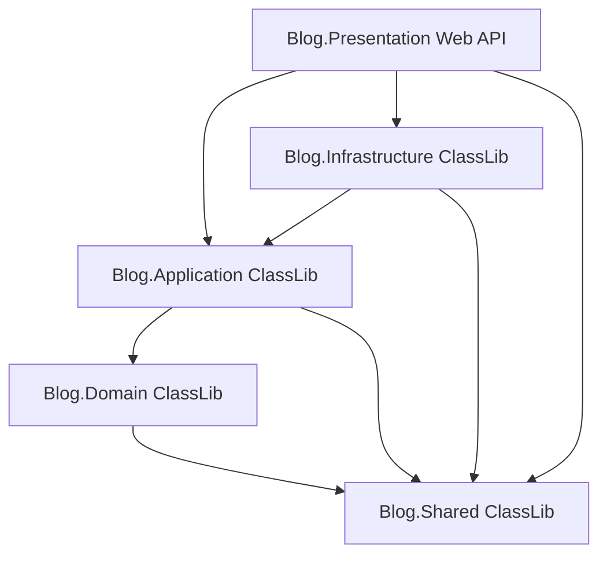

# Project Architecture - .NET 10 Clean Architecture

This document describes the design patterns, layer organization, and flow of control for the backend API.

## Layer Structure
The backend is structured as a multi-project .NET 10 solution following Clean Architecture principles:



1. **Blog.Shared**: Common building blocks, Result pattern, Errors, utility interfaces.
2. **Blog.Domain**: Enterprise domain models (Rich domain, validators, static factories), domain errors, value objects.
3. **Blog.Application**: Use cases, CQRS commands/queries, handlers, DTOs, mapping interfaces.
4. **Blog.Infrastructure**: Data access (EF Core, MySQL), ASP.NET Identity overrides, external services.
5. **Blog.Presentation**: Web API, controllers, custom middlewares (error handling), program entry point.

---

## Key Design Patterns & Strategies

### 1. Result Pattern (No Exceptions for Control Flow)
Every layer returns a `Result` or `Result<T>` instead of throwing business exceptions or returning nulls.
- `Result.Success()` indicates successful execution.
- `Result.Failure(Error)` indicates a business rule violation.

### 2. CQRS without MediatR
To keep dependencies clean and type-safe, CQRS handlers are injected directly. We define explicit interfaces:

```csharp
public interface ICommandHandler<in TCommand, TResponse>
{
    Task<Result<TResponse>> HandleAsync(TCommand command, CancellationToken cancellationToken = default);
}

public interface IQueryHandler<in TQuery, TResponse>
{
    Task<Result<TResponse>> HandleAsync(TQuery query, CancellationToken cancellationToken = default);
}
```
Handlers are registered in the DI container and injected into Controllers. This avoids MediatR reflection overhead and provides absolute compile-time safety.

### 3. Exception Handling Middleware
A global exception middleware captures unhandled exceptions (e.g. database connectivity loss) and transforms them into standard RFC 7807 Problem Details HTTP responses, preventing internal server details from leaking.

### 4. Rich Domain Models
Domain models protect their state with private/protected constructors. Instances can only be created via static factories that execute validation rules.
If validations fail, they return a `Result<Entity>` with appropriate domain errors.

---

## Testing Strategy (xUnit & TDD)

To ensure code reliability and adhere to Test-Driven Development (TDD) principles:
- **Test Project**: A dedicated unit testing project (`Blog.UnitTests`) using **xUnit** is added to the solution.
- **Scope**: Core logic in the Domain layer (`Blog.Domain`) and use cases in the Application layer (`Blog.Application`) must have complete test coverage.
- **TDD Flow**: Each new function, action, or method must be preceded by a corresponding unit test to validate its behavior and outcomes.
