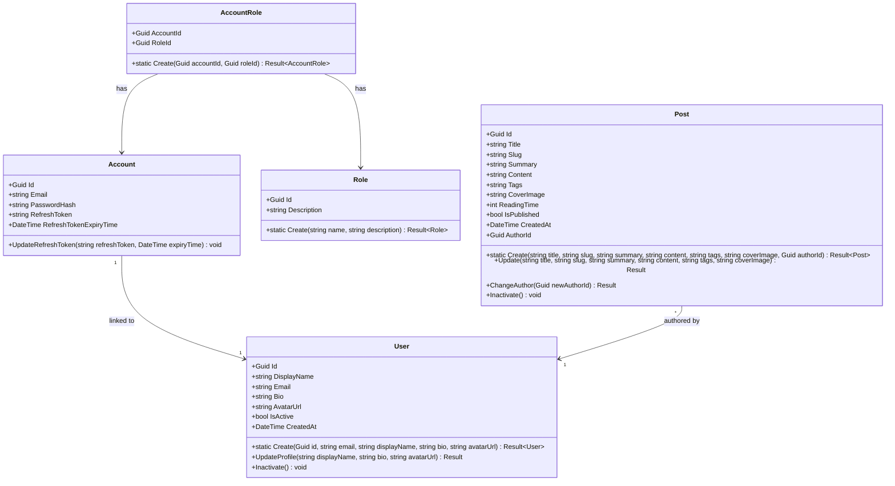

# Domain Models & Identity

This document defines the domain models and identity configurations using rich domain model principles.

## Rich Domain Models Principles
1. **Encapsulation**: Class properties have private setters (`private set`).
2. **Private/Protected Constructors**: Restricts direct instantiation using the `new` keyword from outside the class.
3. **Static Factory Methods**: Every entity has a static factory method (e.g. `Create`) that returns a `Result<T>`.
4. **Validation**: A validator checks all inputs before creating the instance.

---

## Class Diagram



---

## Identity vs. Domain Separation

To ensure a clean separation of concerns, the system distinguishes between authentication credentials (**Account**) and the person using the application (**User**):

### 1. Account (Identity Boundary)
- **Layer**: Infrastructure (`Blog.Infrastructure` mapping to `Microsoft.AspNetCore.Identity`)
- **Responsibility**: Security, credentials validation, password hashing, roles membership, token generation, and token rotation (Refresh Tokens).
- **Inheritance**: `Account` inherits `IdentityUser<Guid>`, `Role` inherits `IdentityRole<Guid>`, and `AccountRole` inherits `IdentityUserRole<Guid>`.

### 2. User (Core Business Boundary)
- **Layer**: Domain (`Blog.Domain`)
- **Responsibility**: Profile details (DisplayName, Email, Bio, AvatarUrl), account activity state, and connection with core aggregates like `Post`.
- **Encapsulation**: Designed as a rich domain model with a private constructor and a static factory method (`Create`) verifying domain invariants.

---

## Registration and Authentication Validation Flow
1. Check email format and password strength via validation rules.
2. Check if username/email already exists in `Accounts`.
3. Create the `Account` in the Identity DB context.
4. Create the corresponding `User` profile in the Domain context using the new Account's `Id`.
5. Perform operations in a transactional unit of work to ensure consistency.

---

## Reading Time Heuristic

The `ReadingTime` of a `Post` is calculated dynamically on the backend (inside the `Post` entity) during creation and modification. It is not provided by the client.

### Heuristic Rule
- **Word Count**: Splitting the Markdown/plain text `Content` by whitespace characters (spaces, line breaks, tabs).
- **Reading Speed**: Average adult reading speed is set to **200 words per minute (WPM)**.
- **Formula**:
  $$\text{ReadingTime (minutes)} = \max\left(1, \left\lceil \frac{\text{Word Count}}{200} \right\rceil\right)$$
- **Logic**:
  ```csharp
  private static int CalculateReadingTime(string content)
  {
      if (string.IsNullOrWhiteSpace(content))
          return 0;

      const int WordsPerMinute = 200;
      int wordCount = content.Split(new[] { ' ', '\r', '\n', '\t' }, StringSplitOptions.RemoveEmptyEntries).Length;
      
      int minutes = (int)Math.Ceiling(wordCount / (double)WordsPerMinute);
      return Math.Max(1, minutes);
  }
  ```

---

## Deletion Constraints & Rules

- **Post Association Block**: An `Account` and its corresponding `User` profile cannot be deleted if there are any `Post` records associated with the user (where `Post.AuthorId == User.Id`).
- **Validation Execution**: This validation rule is executed by the command handler in the Application layer before triggering any database deletions. If posts are associated with the user, the handler returns a failure result (`Result.Failure(UserErrors.HasAssociatedPosts)`). The user must delete or re-attribute their posts before they can close/delete their account.
