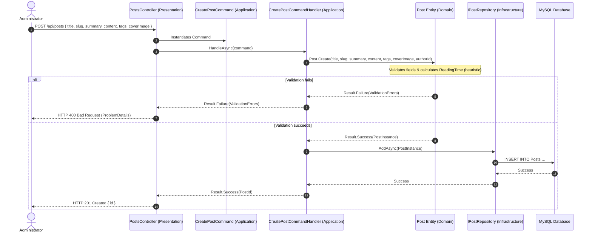
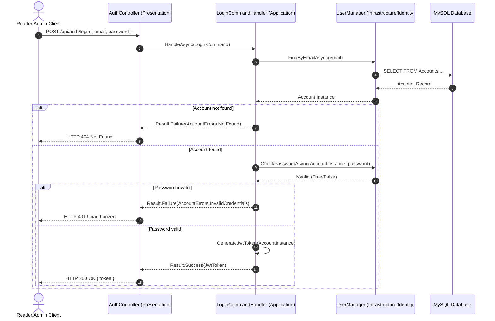
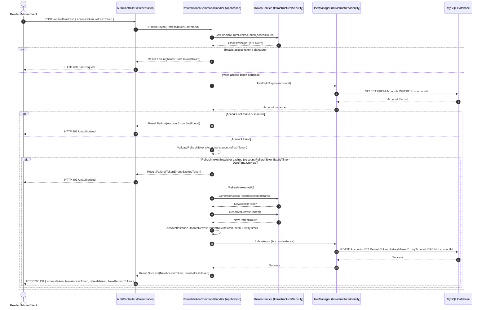

# Sequence Diagrams

This document contains sequence diagrams illustrating the flow of messages between layers for key operations.

## 1. Create Post Flow (CQRS & Result Pattern)

---

## 2. Authentication Flow (ASP.NET Core Identity & JWT)

---

## 3. Refresh Token Flow (Token Rotation & Session Extension)

