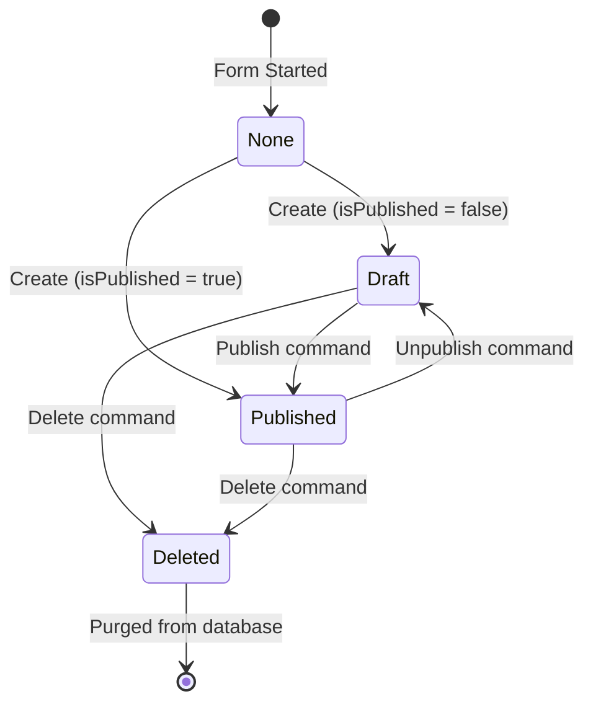
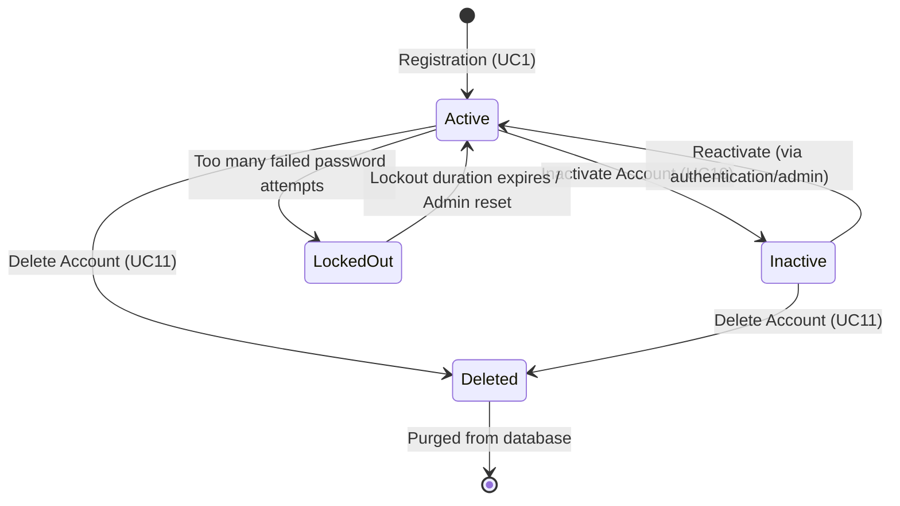

# State Diagrams

This document defines the lifecycle states for posts and account status.

## 1. Post State Lifecycle

A post can transition through various states from initialization to deletion:

- **Draft**: The article is saved in the database but is only visible to the Admin. It cannot be accessed by readers.
- **Published**: The article is active and public. Anyone can query it.
- **Deleted**: The article has been soft-deleted or marked for deletion and is no longer queryable.

---

## 2. Account Security State Lifecycle

An account security boundary transitions through these authentication states:

- **Active**: Account is valid, verified, and eligible for JWT token generation.
- **Inactive**: Logins are blocked, but the user profile data remains intact.
- **LockedOut**: Logins are temporarily blocked for security reasons.
- **Deleted**: The credentials and profile are permanently removed.
