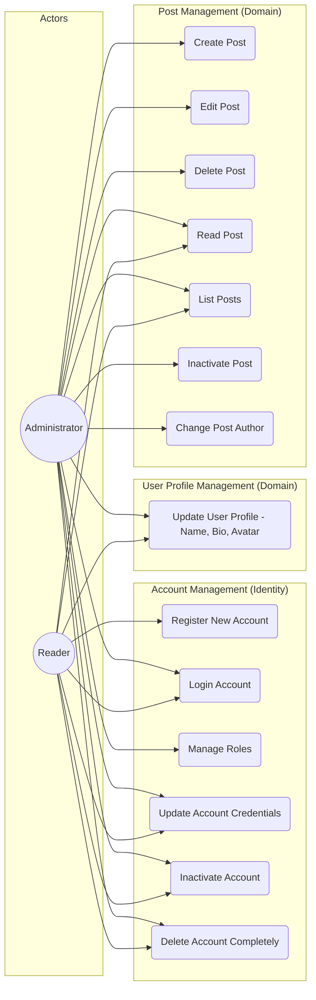

# Use Cases

This document defines the functional requirements and use cases for the Blog and Account management systems.

## Use Case Diagram

---

## Detailed Use Cases

### 1. Register New Account (UC1)
- **Actor**: Reader
- **Description**: The reader registers themselves on the platform to obtain login credentials.
- **Preconditions**: Email must be unique and valid.
- **Postconditions**: A new `Account` (Identity credentials) with the "Reader" role and an associated `User` profile (Domain entity) are created in the database.

### 2. Login Account (UC2)
- **Actor**: Reader / Administrator
- **Description**: Authenticates into the platform using email and password to receive a secure JWT access token and a refresh token.

### 3. Manage Roles (UC3)
- **Actor**: Administrator (Authenticated)
- **Description**: The administrator manages roles associated with accounts (e.g., granting Author privileges to a Reader's account).
- **Postconditions**: The account's claims and roles are updated in the database.

### 4. Create Post (UC4)
- **Actor**: Administrator (Authenticated)
- **Description**: Creates a new article. The system calculates the reading time and verifies formatting.
- **Postconditions**: The markdown content is stored in the database, and metadata is published.

### 5. Edit Post (UC5)
- **Actor**: Administrator (Authenticated)
- **Description**: Modifies the content, title, tags, or metadata of an existing article.
- **Postconditions**: The updated post details are persisted to the database.

### 6. Delete Post (UC6)
- **Actor**: Administrator (Authenticated)
- **Description**: Deletes an article from the blog.
- **Postconditions**: The article record and its corresponding markdown file data are removed from the database.

### 7. Read Post (UC7)
- **Actor**: Reader (Guest/Unregistered or Authenticated) / Administrator
- **Description**: Displays the details and parsed markdown of an article. No registration or authentication is required to read published posts.
- **Preconditions**: Post must be published for guest/unregistered readers. Un-published posts require Administrator authentication.

### 8. List Posts (UC8)
- **Actor**: Reader (Guest/Unregistered or Authenticated) / Administrator
- **Description**: Queries a list of articles, allowing filtering by tag, search queries, or pagination. No registration or authentication is required to browse the list.
- **Preconditions**: Only published posts are listed for guest/unregistered readers.

### 9. Update User Profile (UC9)
- **Actor**: Reader / Administrator (Authenticated)
- **Description**: The user updates their own public profile details, including display name, bio, and avatar.
- **Postconditions**: The changes are validated and saved to the domain database.

### 10. Inactivate Account (UC10)
- **Actor**: Reader / Administrator (Authenticated)
- **Description**: The user temporarily deactivates their security account. Logins will be blocked, but data remains stored.

### 11. Delete Account Completely (UC11)
- **Actor**: Reader / Administrator (Authenticated)
- **Description**: The user permanently deletes their account (credentials and profile) and all personal details from the database.
- **Preconditions**: The user must not have any posts associated with them. If posts exist, account deletion is blocked (the user must delete or re-attribute their posts first).
- **Postconditions**: The account credentials and the user profile are permanently removed from the database.

### 12. Inactivate Post (UC12)
- **Actor**: Administrator (Authenticated)
- **Description**: The administrator temporarily deactivates a post (unpublishes it or marks it inactive) so that it is no longer visible to guest/unregistered readers.
- **Postconditions**: The post status is updated and hidden from public queries, but the data remains stored in the database.

### 13. Update Account Credentials (UC13)
- **Actor**: Reader / Administrator (Authenticated)
- **Description**: The user updates their security account credentials, such as email and password.
- **Postconditions**: The credentials changes are securely validated and persisted in the Identity system.

### 14. Change Post Author (UC14)
- **Actor**: Administrator (Authenticated)
- **Description**: The administrator changes/transfers the author of a post to another administrator or author user.
- **Preconditions**: Both the target post and the target author (User) must exist in the database. The new author must be active.
- **Postconditions**: The post's `AuthorId` property is updated to match the new author's user ID.
